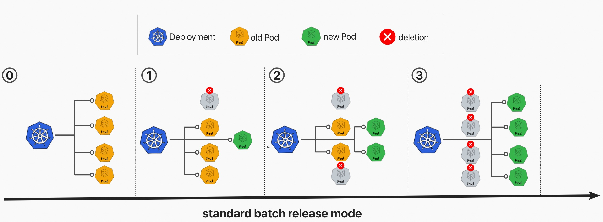

# kruise-rollout

[Kruise Rollout](https://github.com/openkruise/rollouts/blob/master/docs/getting_started/introduction.md) is a Bypass component which provides advanced deployment capabilities such as canary, traffic routing,
and progressive delivery features, for a series of Kubernetes workloads, such as Deployment and CloneSet.

Until 0.2.0 version, kruise-rollout has supported the **canary release mode** (with an extra canary Deployment) for Deployment.


Since 0.3.0 version, kruise-rollout has supported the **standard batch release mode** (without any extra canary Deployment) for Deployment via adding `releaseMode: batch` parameter.
Benefiting from this release mode:
- No extra resources need to be paid for release.
- Deployment name will not be changed anymore.
- Fully compatible with HPA.



## Install

```shell
vela addon enable kruise-rollout
```

## Uninstall

```shell
vela addon disable kruise-rollout
```

## Usage

**Notice: Please make sure the version of  Vela-cli `>=1.5.0-alpha.1`**


### First Deployment

Deploy the application, default is canary release mode:

```shell
cat <<EOF | vela up -f -
apiVersion: core.oam.dev/v1beta1
kind: Application
metadata:
  name: canary-demo
  annotations:
    app.oam.dev/publishVersion: v1
spec:
  components:
  - name: canary-demo
    type: webservice
    properties:
      image: barnett/canarydemo:v1
      ports:
      - port: 8090
    traits:
    - type: scaler
      properties:
        replicas: 5
    - type: gateway
      properties:
        domain: canary-demo.com
        http:
          "/version": 8090
    - type: kruise-rollout
      properties:
        canary:
          # The first batch of Canary releases 20% Pods, and 20% traffic imported to the new version, require manual confirmation before subsequent releases are completed
          steps:
          - weight: 20
          trafficRoutings:
            - type: nginx
EOF
```

Another example for kruise-rollout trait, enable its **standard batch release mode**:
```yaml
### Since kruise-rollout 0.3.0
    - type: kruise-rollout
      properties:
        # enable standard batch release mode
        releaseMode: batch
        canary:
          # The 1-st batch of Canary releases 1 Pods, and the traffic with header `UserAgent=iOS` will be imported to the new version, require manual confirmation before subsequent releases are completed;
          # The 2-nd batch of Canary releases 50% Pods, and 50% traffic will be imported to the new version by default load balance rule of nginx, also require manual confirmation;
          # The 3-rd batch of Canary releases 100% Pods, and 100% traffic will be imported to the new version by default load balance rule of nginx;
          steps:
          - matches: # match the traffic with `UserAgent=iOS` header
            - headers:
              - type: Exact
                name: UserAgent
                value: iOS
            replicas: 1
          - replicas: 50%
          - replicas: 100%
          trafficRoutings:
          - type: nginx

```

Then check the status of application will find out the application is running.

```shell
$ vela status canary-demo
About:

  Name:         canary-demo                  
  Namespace:    default                      
  Created at:   2022-06-09 16:43:10 +0800 CST
  Status:       running                      

Workflow:

  mode: DAG
  finished: true
  Suspend: false
  Terminated: false
  Steps
  - id:x6rnat7iby
    name:canary-demo
    type:apply-component
    phase:succeeded 
    message:

Services:

  - Name: canary-demo  
    Cluster: local  Namespace: default
    Type: webservice
    Healthy Ready:5/5
    Traits:
      ✅ scaler      ✅ gateway: No loadBalancer found, visiting by using 'vela port-forward canary-demo'
      ✅ kruise-rollout: rollout is healthy

```

If you have enabled [velaux](./velaux) addon you can view the application topology graph , then you will see all `v1` pods are ready now.


Access the gateway endpoint with the specific host.
```shell
$ curl -H "Host: canary-demo.com" <ingress-controller-address>/version
Demo: V1
``` 


### Canary Release
Modify the webservice image tag, from v1 to v2, as follows:

```shell
cat <<EOF | vela up -f -
apiVersion: core.oam.dev/v1beta1
kind: Application
metadata:
  name: canary-demo
  annotations:
    app.oam.dev/publishVersion: v2
spec:
  components:
  - name: canary-demo
    type: webservice
    properties:
      image: barnett/canarydemo:v2
      ports:
      - port: 8090
    traits:
    - type: scaler
      properties:
        replicas: 5
    - type: gateway
      properties:
        domain: canary-demo.com
        http:
          "/version": 8090
    - type: kruise-rollout
      properties:
        canary:
          # The first batch of Canary releases 20% Pods, and 20% traffic imported to the new version, require manual confirmation before subsequent releases are completed
          steps:
          - weight: 20
          trafficRoutings:
          - type: nginx
EOF
```

The configuration strategy of kruise-rollout trait means: The first batch of Canary releases 20% Pods, and 20% traffic imported to the new version, require manual confirmation before subsequent releases are completed.

Check the status of applciation:
```shell
$ vela status canary-demo
About:

  Name:         canary-demo                  
  Namespace:    default                      
  Created at:   2022-06-09 16:43:10 +0800 CST
  Status:       runningWorkflow              

Workflow:

  mode: DAG
  finished: false
  Suspend: false
  Terminated: false
  Steps
  - id:8adxa11wku
    name:canary-demo
    type:apply-component
    phase:running 
    message:wait healthy

Services:

  - Name: canary-demo  
    Cluster: local  Namespace: default
    Type: webservice
    Unhealthy Ready:5/5
    Traits:
      ✅ scaler      ✅ gateway: No loadBalancer found, visiting by using 'vela port-forward canary-demo'
      ❌ kruise-rollout: Rollout is in step(1/1), and you need manually confirm to enter the next step

```

The application's status is `runningWorkflow` that means the application's rollout process has not finished yet.

View topology graph again, you will see `kruise-rollout` trait created a `v2` pod, and this pod will serve the canary traffic. Meanwhile, the pods of `v1` are still running and server non-canary traffic.


Access the gateway endpoint again. You will find out there is about 20% chance to meet `Demo: v2` result.

```shell
$ curl -H "Host: canary-demo.com" <ingress-controller-address>/version
Demo: V2
```

### Canary validation successful, full release

After user verifies the success of the canary version through business-related metrics, such as logs, metrics, and other means, you can resume the workflow to continue the process of rollout.

```shell
vela workflow resume canary-demo
```

## Canary verification failed, rollback

If you want to cancel the rollout process and rollback the application to the latest version, after manually check. You can use this command:
```shell
vela workflow rollback canary-demo
```

Access the gateway endpoint again. You can see the result always is `Demo: V1`
```shell
$ curl -H "Host: canary-demo.com" <ingress-controller-address>/version
Demo: V1
```