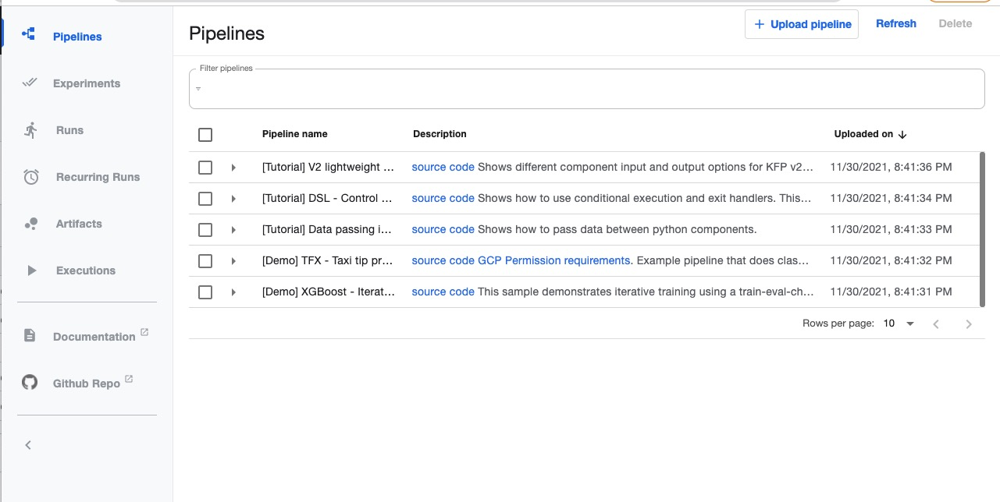
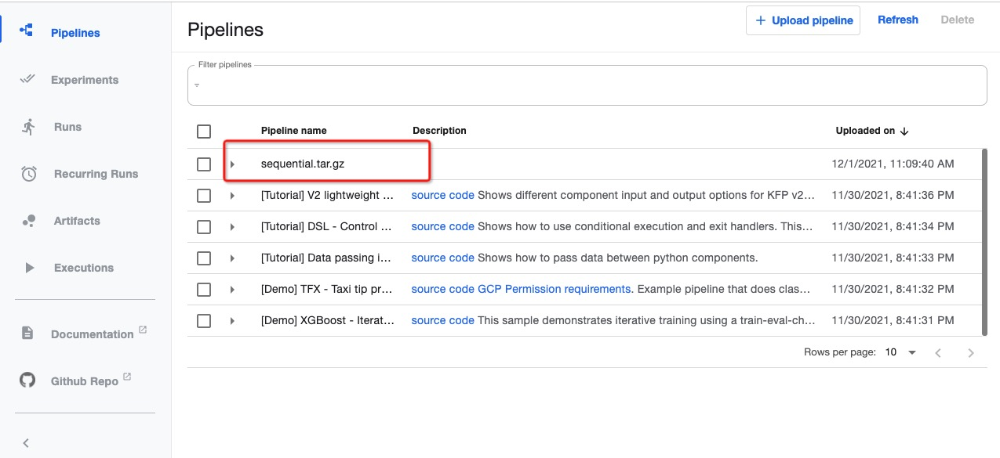

# Kubeflow Pipelines on KubeVela

This addon is for installing [Kubeflow Pipeline](https://www.kubeflow.org/docs/components/pipelines/).

## Install

### Ensure default StorageClass exists

First check if you cluster has default StorageClass:

```
kubectl get storageclass
```

This is what it looks on AlibabaCloud:

```
NAME                                PROVISIONER                       RECLAIMPOLICY   VOLUMEBINDINGMODE      ALLOWVOLUMEEXPANSION   AGE
alicloud-disk-available (default)   diskplugin.csi.alibabacloud.com   Delete          Immediate              true                   21h
alicloud-disk-efficiency            diskplugin.csi.alibabacloud.com   Delete          Immediate              true                   21h
```

If it doesn't, patch the following annotation to your storage class:

```
kubectl patch storageclass <your-storageclass> -p '{"metadata": {"annotations":{"storageclass.kubernetes.io/is-default-class":"true"}}}'
```

### Install Kubeflow Addon

Install it via CLI:

```
vela addon enable kubeflow-pieline
```

Or you can enable it via UI.

## Verify

After it is installed, run:

```
kubectl port-forward -n kubeflow svc/ml-pipeline-ui 8080:80
```

Then access `http://localhost:8080/`, you will see:




## Run an app

Save the following as `app.yaml`:

```yaml
apiVersion: core.oam.dev/v1beta1
kind: Application
metadata:
  name: test-kfp
spec:
  components:
    - name: sequential-example
      type: build-upload-kfp
      properties:
        pipelineURL: https://raw.githubusercontent.com/kubeflow/pipelines/master/samples/core/sequential/sequential.py
```

Run:

```
kubectl apply -f app.yaml
```

It will automatically downloads the [`sequential.py` sample pipeline](https://github.com/kubeflow/pipelines/blob/master/samples/core/sequential/sequential.py),
and builds and uploads it to Kubeflow Pipelines service:


