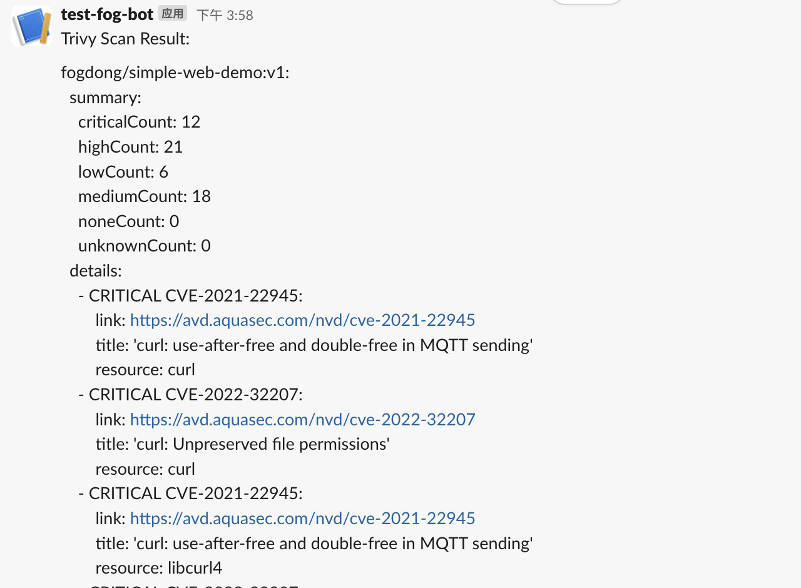

# trivy-operator

# description
- This addon provides a vulnerability scanner that continuously scans containers deployed in a Kubernetes cluster.
- For detail, please checkout [AquaSecurity Trivy Operator](https://github.com/aquasecurity/trivy-operator).
    
## Install

```shell
vela addon enable trivy-operator
```

## Uninstall

```shell
vela addon disable trivy-operator
```

## Quick start

After the addon is enabled, check the status of trivy addon:

```shell
$ vela status addon-trivy-operator -n vela-system --tree --detail
CLUSTER       NAMESPACE        RESOURCE                                    STATUS    APPLY_TIME          DETAIL
local     ─┬─ -            ─── Namespace/trivy-system                      updated   2022-11-04 03:30:07 Status: Active  Age: 2m10s
           └─ trivy-system ─┬─ Service/trivy-system-helm-prometheus-scrape updated   2022-11-04 03:30:12 Type: ClusterIP  Cluster-IP: 10.43.21.81  External-IP: <none>  Port(s): 9115/TCP  Age: 2m5s
                            ├─ HelmRelease/trivy-system-helm               updated   2022-11-04 03:30:12 Ready: True  Status: Release reconciliation succeeded  Age: 2m5s
                            └─ HelmRepository/trivy-system-helm            updated   2022-11-04 03:30:12 URL: https://devopstales.github.io/helm-charts  Age: 2m5s  Ready: True
                                                                                                         Status: stored artifact for revision 'd120de77328f9ccbaaf5bfe8737220cac718bf34e98493d63b94ae20a4d0b92d'
```

Aqua Trivy Operator will scan all the workloads in the cluster.

Apply an application to scan your image, following application will first deploy a `webservice` with a risky image, then scan the image and send the image result with notification.

> Check out [Notification docs](https://kubevela.io/docs/end-user/workflow/built-in-workflow-defs#notification) to see how to configure your notification.

```shell
apiVersion: core.oam.dev/v1beta1
kind: Application
metadata:
  name: example
  namespace: default
spec:
  components:
    - name: frontend
      type: webservice
      properties:
        port: 8000
        image: fogdong/simple-web-demo:v1
  workflow:
    steps:
      - name: apply-comp
        type: apply-component
        properties:
          component: frontend
      - name: image-scan
        type: trivy-check
        outputs:
          - name: image-scan-result
            valueFrom: result.message
        properties:
          resource:
            name: frontend
      - name: notification
        type: notification
        inputs:
          - from: image-scan-result
            parameterKey: slack.message.text
        if: always
        properties:
          slack:
            url:
              value: <your slack>
```

Deploy this application:

```shell
vela up -f example.yaml
```

Checkout the application status:

```
$ vela status example
About:

  Name:         example                      
  Namespace:    default                      
  Created at:   2022-12-22 16:12:11 +0800 CST
  Status:       running                      

Workflow:

  mode: StepByStep-DAG
  finished: true
  Suspend: false
  Terminated: false
  Steps
  - id: z26279ngn1
    name: apply-comp
    type: apply-component
    phase: succeeded 
  - id: 92xcnw1dvc
    name: image-scan
    type: trivy-check
    phase: succeeded 
  - id: i64nsj12sg
    name: notification
    type: notification
    phase: succeeded 

Services:

  - Name: frontend  
    Cluster: local  Namespace: default
    Type: webservice
    Healthy Ready:1/1
    No trait applied
```

All the steps are successful! Trivy-operator will scan the image and send the result with CVE info to your slack channel like:



## More

If you want to check out the scan data in raw, you can check the `vuln` in the cluster:

```shell
kubectl get vuln
```

## Reference

https://github.com/aquasecurity/trivy-operator
