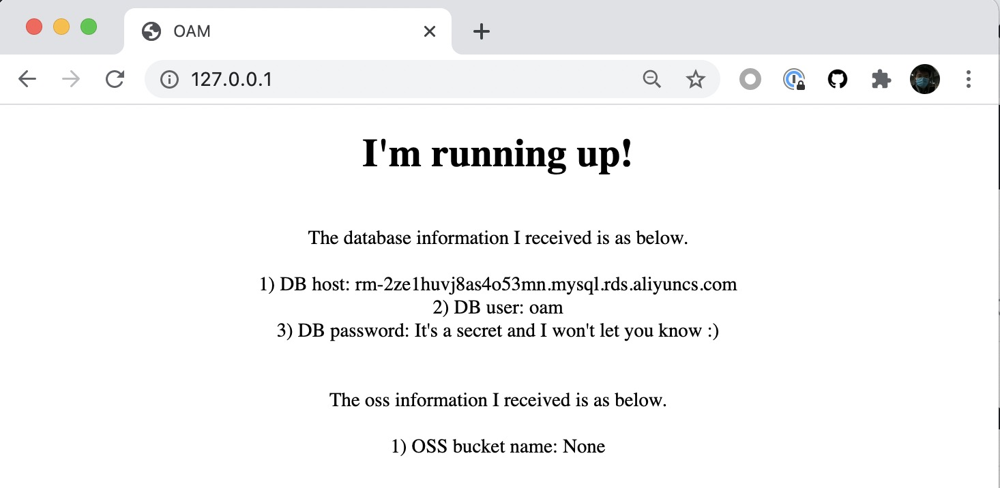

# Crossplane cloud resource provisioning and consuming 

These demonstrations show how cloud resourced are provisioned by Crossplane provider, and consumed by KubeVela applications.

> The demonstrations are verified in Alibaba Kubernetes Cluster v1.18.8 in Hongkong region.

## Prerequisites
- kubectl

- KubeVela v1.0.0-rc
  
- Crossplane provider-alibaba v0.5.0
  
  Refer to [Installation](https://github.com/crossplane/provider-alibaba/releases/tag/v0.5.0) to install Crossplane Alibaba provider.

  ```
  $ kubectl crossplane install provider crossplane/provider-alibaba:v0.5.0

  $ kubectl create secret generic alibaba-account-creds -n crossplane-system --from-literal=accessKeyId=xxx --from-literal=accessKeySecret=yyy

  $ kubectl apply -f provider.yaml
  ```

## Part I: Provision cloud resources

### Prepare ComponentDefinition `alibaba-rds`

[componentdefinition-rds.yaml](./componentdefinition-rds.yaml) is the ComponentDefinition for Alibaba RDS cloud resource,
which aims to create an RDS instance from Alibaba Cloud by Crossplane Alibaba provider.

```yaml
apiVersion: core.oam.dev/v1beta1
kind: ComponentDefinition
metadata:
  name: alibaba-rds
  namespace: vela-system
  annotations:
    definition.oam.dev/description: "Alibaba Cloud RDS Resource"
spec:
  workload:
    definition:
      apiVersion: database.alibaba.crossplane.io/v1alpha1
      kind: RDSInstance
  schematic:
    cue:
      template: |
        output: {
        	apiVersion: "database.alibaba.crossplane.io/v1alpha1"
        	kind:       "RDSInstance"
        	spec: {
        		forProvider: {
        			engine:                parameter.engine
        			engineVersion:         parameter.engineVersion
        			dbInstanceClass:       parameter.instanceClass
        			dbInstanceStorageInGB: 20
        			securityIPList:        "0.0.0.0/0"
        			masterUsername:        parameter.username
        		}
        		writeConnectionSecretToRef: {
        			namespace: context.namespace
        			name:      context.outputSecretName
        		}
        		providerConfigRef: {
        			name: "default"
        		}
        		deletionPolicy: "Delete"
        	}
        }
        parameter: {
        	engine:          *"mysql" | string
        	engineVersion:   *"8.0" | string
        	instanceClass:   *"rds.mysql.c1.large" | string
        	username:        string
        }

```

### Deploy an application

The application [application-1-provision-cloud-service.yaml](./application-1-provision-cloud-service.yaml) will just include
a component based the ComponentDefinition as above to create an RDS instance.

```yaml
apiVersion: core.oam.dev/v1beta1
kind: Application
metadata:
  name: baas-rds
spec:
  components:
    - name: sample-db
      type: alibaba-rds
      properties:
        name: sample-db
        engine: mysql
        engineVersion: "8.0"
        instanceClass: rds.mysql.c1.large
        username: oamtest
        outputSecretName: db-conn

```

Apply it and watch the cloud resource provisioning. A secret `db-conn` will also be created in the same namespace as that of
the application.

```shell
$ kubectl apply -f application-1-provision-cloud-service.yaml

$ kubectl get application
NAME       AGE
baas-rds   9h

$ kubectl get component
NAME             WORKLOAD-KIND   AGE
sample-db        RDSInstance     9h

$ kubectl get rdsinstance
NAME           READY   SYNCED   STATE     ENGINE   VERSION   AGE
sample-db-v1   True    True     Running   mysql    8.0       9h

$ kubectl get secret
NAME                                              TYPE                                  DATA   AGE
db-conn                                           connection.crossplane.io/v1alpha1     4      9h

$ ✗ kubectl get secret db-conn -o yaml
apiVersion: v1
data:
  endpoint: xxx==
  password: yyy
  port: MzMwNg==
  username: b2FtdGVzdA==
kind: Secret
```

It shows the connection secret of Cloud resource RDSInstance is successfully generated. I could be consumed by some business
applications.

## Part II: Consume cloud resources

### Introduction
Create business application `webapp` with the Application manifests [application-2-consume-cloud-resource.yaml](./application-2-consume-cloud-resource.yaml).
It states the outputSecret `db-conn` from component `sample-db` of application `baas-rds` will be used.

```yaml
apiVersion: core.oam.dev/v1beta1
kind: Application
metadata:
  name: webapp
spec:
  components:
    - name: express-server
      type: deployment
      properties:
        image: zzxwill/flask-web-application:v0.3.1-crossplane
        ports: 80
        dbSecret: db-conn
```

In the [componentdefinition-deployment.yaml](./componentdefinition-deployment.yaml) of component `express-server` in 
application `webapp`.

All fields of `dbConn` will be rendered as the value of secret `parameter.dbSecret` respectively per the comment 
`// +insertSecretTo=dbConn`. So `dbConn.endpoint` is the value of key `endpoint` of the secret.

```cue
parameter: {
    ...

	// +usage=Referred db secret
	// +insertSecretTo=dbConn
	dbSecret?: string
    
    ...
}

dbConn: {
    username: string
    endpoint: string
    port:     string
}
```

So we can set the value of env directly.

```cue
env: [
{
    ...
},
{
    name:  "username"
    value: dbConn.username
},
]
```

### Deploy an application

Apply the ComponentDefinition and Application. We'll see the cloud resource is successfully consumed by the business application.

```shell
$ kubectl apply -f componentdefinition-deployment.yaml

$ kubectl apply -f application-2-consume-cloud-resource.yaml

$ kubectl get application
NAME       AGE
baas-rds   10h
webapp     14h

$ kubectl get deployment
NAME                READY   UP-TO-DATE   AVAILABLE   AGE
express-server-v1   1/1     1            1           9h

$ kubectl port-forward deployment/express-server-v1 80:80
```



## Alternatives to consume cloud resource


- Use `context` `dbConn`

With the annotation `// +insertSecretTo=dbConn`, `dbConn` will be inserted into `context` and it's content are all the
key and values of secret `dbSecret`.

```cue
parameter: {
    ...

	// +usage=Referred db secret
	// +insertSecretTo=dbConn
	dbSecret?: string
    
    ...
}
```

We can set the value of environment `endpoint` to `context.dbConn.endpoint`.

```cue
env: [
{
    ...
},
{
    name:  "endpoint"
    value: context.dbConn.endpoint
},
]
```

So the ComponentDefinition can work without section `dbConn`.

```cue
output: {
	apiVersion: "apps/v1"
	kind:       "Deployment"
	spec: {
		selector: matchLabels: {
			"app.oam.dev/component": context.name
		}

		template: {
			metadata: labels: {
				"app.oam.dev/component": context.name
			}

			spec: {
				containers: [{
					...
					
					if parameter["dbSecret"] != _|_ {
						env: [
							{
								name:  "username"
								value: context.dbConn.username
							},
							{
								name:  "endpoint"
								value: context.dbConn.endpoint
							},
							{
								name:  "DB_PASSWORD"
								value: context.dbConn.password
							},
						]
					}

					...
				}]
		}
		}
	}
}

parameter: {
	...

	// +usage=Referred db secret
	// +insertSecretTo=dbConn
	dbSecret?: string

	...
}
```