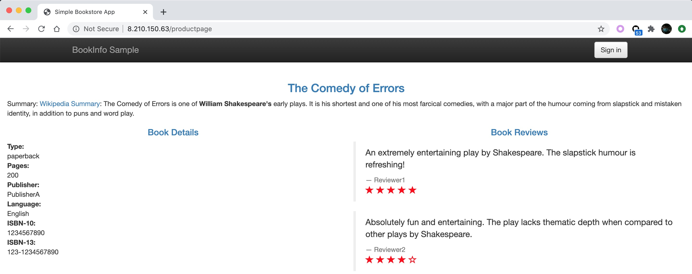

# Istio Bookinfo demo in OAM way
This application demonstrates how OAM bootstraps [Istio Bookinfo application](https://istio.io/latest/docs/examples/bookinfo/) with workload `Gateway`, `VirtualService`,
`DestinationRule` deployed by OAM.

## Prerequisites
- Helm v3

- OAM Kubernetes Runtime

```
kubectl create namespace crossplane-system
helm repo add crossplane-alpha https://charts.crossplane.io/alpha
helm install addon-oam-kubernetes-local --namespace crossplane-system crossplane-alpha/oam-core-resources
```

- OAM workloads/traits definitions

```
$ kubectl apply -f https://raw.githubusercontent.com/crossplane/crossplane/release-0.12/docs/snippets/run/definitions.yaml
workloaddefinition.core.oam.dev/containerizedworkloads.core.oam.dev created
traitdefinition.core.oam.dev/manualscalertraits.core.oam.dev created
workloaddefinition.core.oam.dev/postgresqlinstancerequirements.database.example.org created

```

(TODO)  ** The root cause why this depends on installation of Crossplane has to be investigated.**
```
$ kubectl apply -f https://raw.githubusercontent.com/crossplane/crossplane/release-0.12/docs/snippets/run/definitions.yaml

unable to recognize "https://raw.githubusercontent.com/crossplane/crossplane/release-0.12/docs/snippets/run/definitions.yaml": no matches for kind "WorkloadDefinition" in version "core.oam.dev/v1alpha2"
unable to recognize "https://raw.githubusercontent.com/crossplane/crossplane/release-0.12/docs/snippets/run/definitions.yaml": no matches for kind "TraitDefinition" in version "core.oam.dev/v1alpha2"
unable to recognize "https://raw.githubusercontent.com/crossplane/crossplane/release-0.12/docs/snippets/run/definitions.yaml": no matches for kind "WorkloadDefinition" in version "core.oam.dev/v1alpha2"
```

- Istio 1.6.3

Pleaser refer to [Download and Install Istio](https://istio.io/latest/docs/setup/getting-started/).

## Deploy the application

```
$ kubectl apply -f bookinfo.yaml
```
(TODO) Not sure whether `Service` and `Deployment` from [bookinfo.yaml](./bookinfo.yaml) should be converted to
`Component` as [component-bookinfo](./component-bookinfo.yaml)? 

Make sure all pods of the application are running.
```
✗ kubectl get pods
NAME                              READY   STATUS    RESTARTS   AGE
details-v1-78db589446-64bm8       2/2     Running   0          5h13m
productpage-v1-7f4cc988c6-fpttn   2/2     Running   0          5h13m
ratings-v1-756b788d54-pp8wm       2/2     Running   0          5h13m
reviews-v1-849fcdfd8b-f52lz       2/2     Running   0          5h13m
reviews-v2-5b6fb6c4fb-wkpbs       2/2     Running   0          5h13m
reviews-v3-7d94d58566-b5lv6       2/2     Running   0          5h13m
```

## Configuring ingress using an Istio gateway
Apply [component-gateway.yaml](./component-gateway.yaml) and [appconfig-1-bookinfo-VirtualService.yaml](./appconfig-1-bookinfo-VirtualService.yaml).

Get `INGRESS_HOST` from Istio IngressGateway.
```
✗ kubectl get svc istio-ingressgateway -n istio-system
NAME                   TYPE           CLUSTER-IP       EXTERNAL-IP    PORT(S)                                                                      AGE
istio-ingressgateway   LoadBalancer   172.18.193.118   8.210.150.63   15020:32295/TCP,80:32185/TCP,443:30935/TCP,31400:30087/TCP,15443:31543/TCP   5h22m
```

Get `INGRESS_PORT` from Gateway.
```
✗ k get Gateway bookinfo-gateway -o yaml
apiVersion: networking.istio.io/v1beta1
kind: Gateway
...
spec:
  selector:
    istio: ingressgateway
  servers:
  - hosts:
    - '*'
    port:
      name: http
      number: 80
      protocol: HTTP
```

Get accpeted url from VirtualService.
```
✗ k get VirtualService bookinfo -o yaml
apiVersion: networking.istio.io/v1beta1
kind: VirtualService
...
spec:
  gateways:
  - bookinfo-gateway
  hosts:
  - '*'
  http:
  - match:
    - uri:
        exact: /productpage
    - uri:
        prefix: /static
    - uri:
        exact: /login
    - uri:
        exact: /logout
    - uri:
        prefix: /api/v1/products
    route:
    - destination:
        host: productpage
        port:
          number: 9080
```
Visit `http://8.210.150.63/productpage`.


(TODO) ** It's complicated to retrieve the endpoint compared to the way of [Knative Route](https://github.com/oam-dev/samples/blob/master/6.Knative_with_Cloud_Resource_App/README.md#deploy-application). Need find a better way. **

## Apply default destination rules
Apply [appconfig-2-bookinfo-DestinationRule.yaml](./appconfig-2-bookinfo-DestinationRule.yaml).

Visit the home page again.


Those starts' color of book reviews changes from Red to Black.

(TODO) ** Not sure how to utilize OAM Scope in this scenario. **

