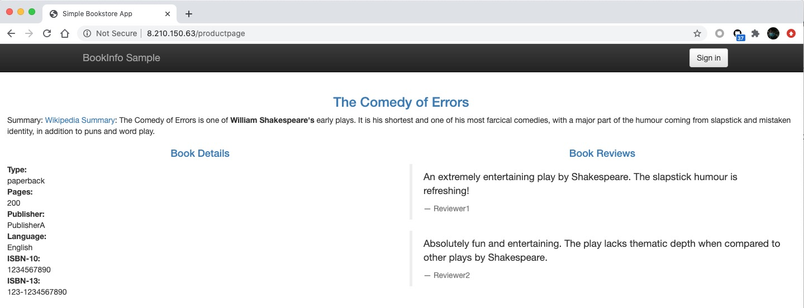
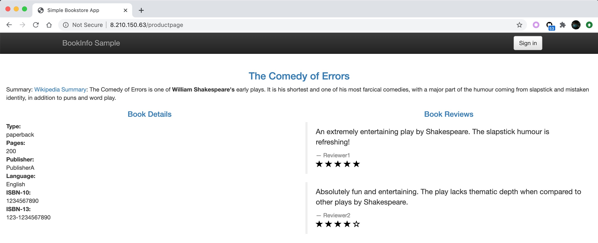

# Istio Bookinfo demo powered by OAM
This application demonstrates how OAM bootstraps [Istio Bookinfo application](https://istio.io/latest/docs/examples/bookinfo/) with workload `Gateway` and `VirtualService` deployed by OAM.

## Prerequisites
- Helm v3

- OAM Kubernetes Runtime

```
kubectl create namespace crossplane-system
helm repo add crossplane-alpha https://charts.crossplane.io/alpha
helm install addon-oam-kubernetes-local --namespace crossplane-system crossplane-alpha/oam-core-resources
```

- Istio 1.6.3

Pleaser refer to [Download and Install Istio](https://istio.io/latest/docs/setup/getting-started/).


## Deploy the application

Remember to apply [rbac.yaml](./rbac.yaml) first for needed access controls.

```shell script
$ kubectl apply -f rbac.yaml
serviceaccount/bookinfo-details created
serviceaccount/bookinfo-ratings created
serviceaccount/bookinfo-reviews created
serviceaccount/bookinfo-productpage created
clusterrole.rbac.authorization.k8s.io/bookinfo-clusterrole created
clusterrolebinding.rbac.authorization.k8s.io/bookinfo-binding created
```

Apply all components manifests under [Components](./Components). Noted `component-bookinfo-reviews-VERSION.yaml`
represents three different versions (v1, v2 and v3) for bookinfo module `reviews`. 

```shell script
$ kubectl apply -f Components
component.core.oam.dev/details created
component.core.oam.dev/productpage created
component.core.oam.dev/ratings created
component.core.oam.dev/reviews-v1 created
component.core.oam.dev/reviews-v2 created
component.core.oam.dev/reviews-v3 created
```

Apply manifests `TraitDefinition` and `ScopeDefinition` in [definitions.yaml](./definitions.yaml), and Istio
networking Gateway workload manifest in [Scope/scope-gateway.yaml](Scopes/scope-gateway.yaml) which will work as
the controller for scope `bookinfo-gateway` in the next step.

```shell script
$ kubectl apply -f definitions.yaml
traitdefinition.core.oam.dev/virtualservices.networking.istio.io created
scopedefinition.core.oam.dev/gateway.netwoking.istio.scops created
```

In [appconfig-1-bookinfo.yaml](./appconfig-1-bookinfo.yaml), the ApplicationConfiguration consists of four components:
`details`, `ratings`, `reviews-v1` and `productpage`; each component is being applied with a Service trait respectively.
Besides, trait `VirtualService` and scope `bookinfo-gateway` also apply on component `productpage`.
```yaml
apiVersion: core.oam.dev/v1alpha2
kind: ApplicationConfiguration
metadata:
  name: bookinfo
spec:
  components:
    - componentName: details
      traits:
        - trait:
            apiVersion: v1
            kind: Service
            metadata:
              name: details
              labels:
                app: details
                service: details
            spec:
              ports:
                - port: 9080
                  name: http
              selector:
                app: details

    - componentName: ratings
      ...

    - componentName: reviews-v1
      ...

    - componentName: productpage
      traits:
        - trait:
            ...
        - trait:
            apiVersion: networking.istio.io/v1alpha3
            kind: VirtualService
            metadata:
              name: bookinfo
            ...
      scopes:
        - scopeRef:
            apiVersion: networking.istio.io/v1alpha3
            kind: Gateway
            name: bookinfo-gateway
```

Apply the ApplicationConfiguraiton manifest and wait until all pods of the application are running.
```shell script
$ kubectl apply -f appconfig-1-bookinfo.yaml
applicationconfiguration.core.oam.dev/bookinfo configured

$ kubectl get pods
NAME                              READY   STATUS    RESTARTS   AGE
details-v1-78db589446-qn6hd       2/2     Running   0          11s
productpage-v1-7f4cc988c6-4mndj   2/2     Running   0          11s
ratings-v1-756b788d54-5hc2x       2/2     Running   0          11s
reviews-v1-849fcdfd8b-wkblb       2/2     Running   0          11s
```

We can also get an overview of OAM.
```shell script
$ kubectl get oam
NAME                                             AGE
applicationconfiguration.core.oam.dev/bookinfo   93m

NAME                                 WORKLOAD-KIND
component.core.oam.dev/details       Deployment
component.core.oam.dev/productpage   Deployment
component.core.oam.dev/ratings       Deployment
component.core.oam.dev/reviews-v1    Deployment
component.core.oam.dev/reviews-v2    Deployment
component.core.oam.dev/reviews-v3    Deployment

NAME                                                               DEFINITION-NAME
traitdefinition.core.oam.dev/virtualservices.networking.istio.io   virtualservices.networking.istio.io

NAME                                                         DEFINITION-NAME
scopedefinition.core.oam.dev/gateway.netwoking.istio.scops   bookinfo-gateway
```


## Visit the application
After the application bookinfo is successully deployed by OAM, let's visit it with the power of Istio ingress.

Get `INGRESS_HOST` from Istio IngressGateway.
```shell script
$ kubectl get svc istio-ingressgateway -n istio-system
NAME                   TYPE           CLUSTER-IP       EXTERNAL-IP    PORT(S)                                                                      AGE
istio-ingressgateway   LoadBalancer   172.18.193.118   8.210.150.63   15020:32295/TCP,80:32185/TCP,443:30935/TCP,31400:30087/TCP,15443:31543/TCP   5h22m
```

Get `INGRESS_PORT` from Gateway.
```shell script
$ kubectl get Gateway bookinfo-gateway -o yaml
apiVersion: networking.istio.io/v1beta1
kind: Gateway
...
spec:
  selector:
    istio: ingressgateway
  servers:
  - hosts:
    - '*'
    port:
      name: http
      number: 80
      protocol: HTTP
```

Get accepted url from VirtualService.
```shell script
$ kubectl get VirtualService bookinfo -o yaml
apiVersion: networking.istio.io/v1beta1
kind: VirtualService
...
spec:
  gateways:
  - bookinfo-gateway
  hosts:
  - '*'
  http:
  - match:
    - uri:
        exact: /productpage
    - uri:
        prefix: /static
    - uri:
        exact: /login
    - uri:
        exact: /logout
    - uri:
        prefix: /api/v1/products
    route:
    - destination:
        host: productpage
        port:
          number: 9080
```

Visit `http://8.210.150.63/productpage`.


(TODO) ** It's complicated to retrieve the endpoint information compared to the way of [Knative Route](https://github.com/oam-dev/samples/blob/master/6.Knative_with_Cloud_Resource_App/README.md#deploy-application). Need find a better way. **

## Upgrade the application
Change the version of component reviews and apply the ApplicationConfiguration manifest [appconfig-2-bookinfo-reviews-v2.yaml](./appconfig-2-bookinfo-reviews-v2.yaml).
```shell script
$ diff appconfig-1-bookinfo.yaml appconfig-2-bookinfo-reviews-v2.yaml
  55c55
  <     - componentName: reviews-v1
  ---
  >     - componentName: reviews-v2


$ kubectl apply -f appconfig-2-bookinfo-reviews-v2.yaml
applicationconfiguration.core.oam.dev/bookinfo configured

$ kubectl get pods
NAME                              READY   STATUS    RESTARTS   AGE
details-v1-78db589446-qn6hd       2/2     Running   0          78m
productpage-v1-7f4cc988c6-4mndj   2/2     Running   0          78m
ratings-v1-756b788d54-5hc2x       2/2     Running   0          78m
reviews-v2-5b6fb6c4fb-mn5zq       2/2     Running   0          17s
```

Visit the application again in several seconds.

Starts in black are rated for those reviews.

By upgrading component reviews again, we can see starts becomes red.
```shell script
$ diff appconfig-2-bookinfo-reviews-v2.yaml appconfig-3-bookinfo-reviews-v3.yaml
55c55
<     - componentName: reviews-v2
---
>     - componentName: reviews-v3

$ kubectl apply -f appconfig-3-bookinfo-reviews-v3.yaml
applicationconfiguration.core.oam.dev/bookinfo configured
```


## Summary
In the demonstration, we refactored those manifests from [Istio Bookinfo application](https://istio.io/latest/docs/examples/bookinfo/) to OAM Components, Traits, Scops and
ApplicationConfigurations without changing a single line of them. It shows OAM can easily empower Istio.

Have fun with Istio in an OAM way.


