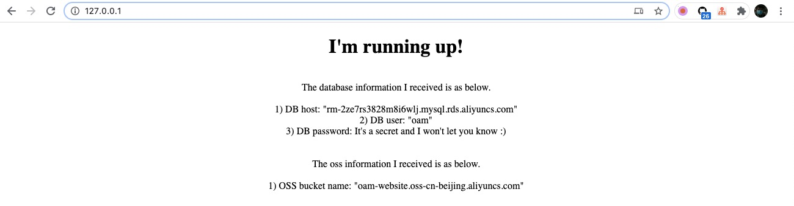

# Using Terraform as IaC module in KubeVela

- Extend Terraform module/files as a Workload type

Let's extend an Alibaba Cloud RDS Mysql Terraform module to a Workload type `aliyun-rds` in [workloadDefinition-rds.yaml](./workloadDefinition-rds.yaml).

```yaml
apiVersion: core.oam.dev/v1alpha2
kind: WorkloadDefinition
metadata:
  name: aliyun-rds
  annotations:
    definition.oam.dev/description: Terraform module for Aliyun RDS object
    type: terraform             # To mark this WorkloadDefinition is Terraform module/manifests
spec:
  definitionRef:
    name: deployments.apps      # "NULL" temporary set to `deployments.apps` to let `vela workloads` work
  extension:
    template: |
      output: {
      	{
      		module: {
      			rds: {
      				source:           "terraform-alicloud-modules/rds/alicloud"
      				engine:           parameter.engine
      				engine_version:   parameter.engine_version
      				instance_type:    parameter.instance_type
      				instance_storage: "20"
      				instance_name:    parameter.name
      				account_name:     parameter.user
      				password:         parameter.password
      			}
      		}
      		output: {
      			db_name: {
      				value: "${module.rds.this_db_instance_name}"
      			}
      			DB_USER: {
      				value: "${module.rds.this_db_database_account}"
      			}
      			db_port: {
      				value: "${module.rds.this_db_instance_port}"
      			}
      			DB_HOST: {
      				value: "${module.rds.this_db_instance_connection_string}"
      			}
      			DB_PASSWORD: {
      				value: "${module.rds.this_db_instance_port}"
      			}
      		}
      	}
      }

      parameter: {
      	engine:         *"MySQL" | string
      	engine_version: *"8.0" | string
      	instance_type: *"rds.mysql.c1.large" | string
      	name:           string
      	user:           string
      	password:       string
      }

```

Also extend an Alibaba OSS bucket Terraform files to a Workload type `aliyun-oss` in [orkloadDefinition-oss.yaml](./workloadDefinition-oss.yaml).

```yaml
apiVersion: core.oam.dev/v1alpha2
kind: WorkloadDefinition
metadata:
  name: aliyun-oss
  annotations:
    definition.oam.dev/description: Terraform files for Aliyun OSS object
    type: terraform             # To mark this WorkloadDefinition is Terraform module/manifests
spec:
  definitionRef:
    name: deployments.apps      # "NULL" temporary set to `deployments.apps` to let `vela workloads` work
  extension:
    template: |
      output: {
      	{
         "resource": {
           "alicloud_oss_bucket": {
             "bucket-acl": {
               "bucket": "${var.bucket}",
               "acl": "private"
             }
           }
         },
         "output": {
           "BUCKET_NAME": {
             "value": "${alicloud_oss_bucket.bucket-acl.bucket}.${alicloud_oss_bucket.bucket-acl.extranet_endpoint}"
           }
         },
         "variable": {
           "bucket": {
             "default": parameter.bucket
           }
         }
       }
      }

      parameter: {
      	bucket:         string
      }

```

Noted:

1). `spec.extension.output` is in Terraform JSON format based on a Terraform module or Terraform JSON files, which will deploy as an RDS Mysql instance, or an OSS bucket.

2). Please kindly ignore `spec.definitionRef` as I just want to make `vela workloads` work as vela cli will check the status of underlying controller. It could be optional if [issue #749](https://github.com/oam-dev/kubevela/issues/749) is fixed.

- Prepare `vela.yaml`

In [vela.yaml](./vela.yaml), please notes:

1). Service `express-server` will display database connection information by retrieving it through Secret `sample-db`, and display OSS bucket
information through Secret `sample-oss`.

2). `aliyun-oss` and `aliyun-oss` are the WorkloadTypes as we defined above, which will generate vela `config` `aliyun-oss` and `aliyun-oss` respectively.
In order to make them available to service `express-server`, I generate a secret for each of them with the same names.

```yaml
name: hello

services:
  express-server:
    type: deployment
    image: zzxwill/flask-web-application:v0.3
    ports: 80
    configRef:
      - name: "sample-db"
        keys:
          - "DB_USER"
          - "DB_HOST"
          - "DB_PASSWORD"
      - name: "sample-oss"
        keys:
          - "BUCKET_NAME"

  sample-db:
    type: aliyun-rds
    name: "poc"
    user: "oam"
    password: "xxx"

  sample-oss:
    type: aliyun-oss
    bucket: "oam-website"

```


- Install Terraform Cli and prepare Terraform environment variables.

[Install Terraform Cli](https://www.terraform.io/downloads.html) and export the following environment variables.

```
export ALICLOUD_ACCESS_KEY=xxx
export ALICLOUD_SECRET_KEY=xxxxxxx
export ALICLOUD_REGION=cn-beijing
```

- Deploy infrastructure resources by `vela up`

```shell
$ vela up
Parsing vela appfile ...
Loading templates ...

Rendering configs for service (express-server)...
Writing deploy config to (.vela/deploy.yaml)


Applying cloud resources sample-db

Applying cloud resources sample-oss

Applying deploy configs ...
Checking if app has been deployed...
App has not been deployed, creating a new deployment...
✅ App has been deployed 🚀🚀🚀
    Port forward: vela port-forward hello
             SSH: vela exec hello
         Logging: vela logs hello
      App status: vela status hello
  Service status: vela status hello --svc express-server

```

- Access the application

```shell
$ sudo vela port-forward hello 80
Password:
? You have multiple services in your app. Please choose one service:  express-server
Forwarding from 127.0.0.1:80 -> 80
Forwarding from [::1]:80 -> 80

Forward successfully! Opening browser ...
Handling connection for 80
Handling connection for 80
Handling connection for 80
```

