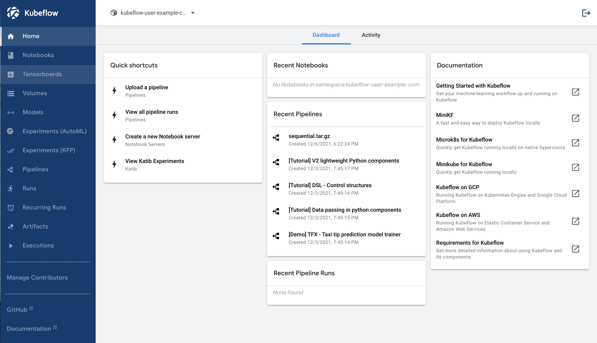
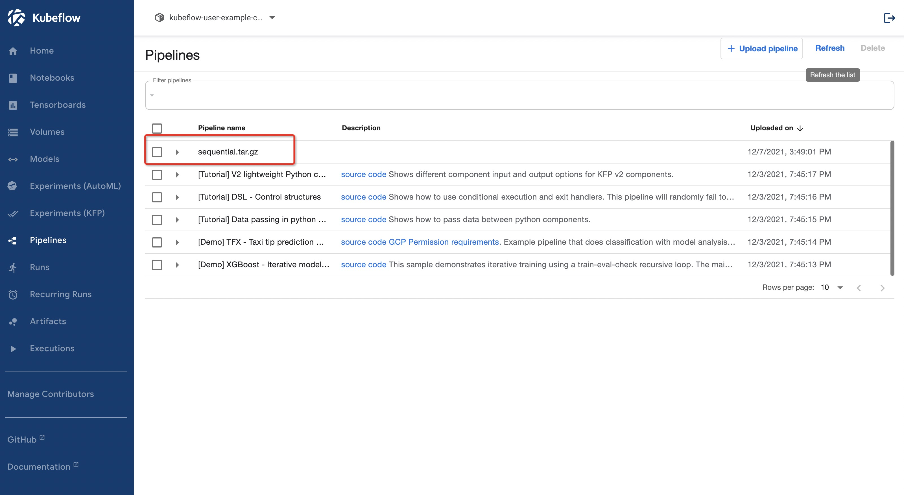
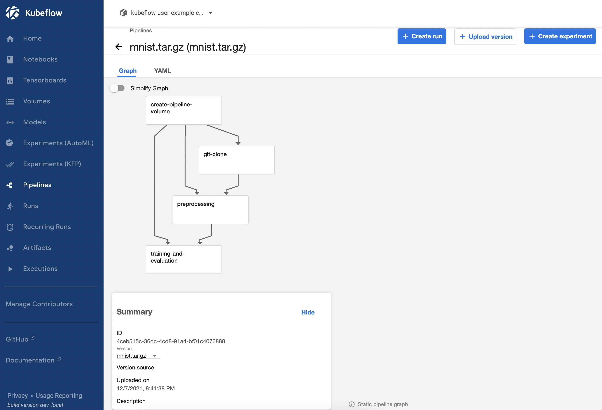

# Kubeflow

Kubeflow addon provides the all-in-one Kubeflow installation. It's based on [kubeflow/manifests](https://github.com/kubeflow/manifests).

## Install

### Ensure default StorageClass exists

First check if you cluster has default StorageClass:

```
kubectl get storageclass
```

This is what it looks on AlibabaCloud:

```
NAME                                PROVISIONER                       RECLAIMPOLICY   VOLUMEBINDINGMODE      ALLOWVOLUMEEXPANSION   AGE
alicloud-disk-available (default)   diskplugin.csi.alibabacloud.com   Delete          Immediate              true                   21h
alicloud-disk-efficiency            diskplugin.csi.alibabacloud.com   Delete          Immediate              true                   21h
```

If it doesn't, patch the following annotation to your storage class:

```
kubectl patch storageclass <your-storageclass> -p '{"metadata": {"annotations":{"storageclass.kubernetes.io/is-default-class":"true"}}}'
```

### Install Kubeflow Addon

Install it via CLI:

```
vela addon enable kubeflow
```

Or you can enable it via UI.


## Verify

After it is installed, run:

```
kubectl port-forward svc/istio-ingressgateway -n istio-system 8080:80
```

Then access `http://localhost:8080/`, you will see:




## Upload an example pipeline

Save the following as `app.yaml`:

```yaml
apiVersion: core.oam.dev/v1beta1
kind: Application
metadata:
  name: test-kfp
spec:
  components:
    - name: sequential-example
      type: upload-kfp
      properties:
        image: acr.kubevela.net/oamdev/kubeflow-tool
        outputDir: /data/kubeflow/
        outputName: sequential.tar.gz
        buildScript: |-
          #!/usr/bin/bash
          set -ex

          PIPELINE_URL=https://raw.githubusercontent.com/kubeflow/pipelines/master/samples/core/sequential/sequential.py
          wget -O sequential.py ${PIPELINE_URL}
          dsl-compile --py sequential.py --output /data/kubeflow/sequential.tar.gz
```

Run:

```
kubectl apply -f app.yaml
```

It will automatically downloads the [`sequential.py` sample pipeline](https://github.com/kubeflow/pipelines/blob/master/samples/core/sequential/sequential.py),
and builds and uploads it to Kubeflow Pipelines service:




## Build and run MNIST pipeline

The code in this section is based on [benjamintanweihao/kubeflow-mnist](https://github.com/benjamintanweihao/kubeflow-mnist).
The process includes:

- git clone the source code
- preprocess data
- training and evaluation of the model

Save the following as `app.yaml`:

```yaml
apiVersion: core.oam.dev/v1beta1
kind: Application
metadata:
  name: test-kfp
spec:
  components:
    - name: mnist-example
      type: upload-kfp
      properties:
        image: acr.kubevela.net/oamdev/kubeflow-mnist
        outputDir: /data/kubeflow/
        outputName: mnist.tar.gz
        buildScript: |-
          #!/usr/bin/bash
          set -ex

          git clone https://github.com/benjamintanweihao/kubeflow-mnist
          dsl-compile --py pipeline.py --output /data/kubeflow/mnist.tar.gz
```

Run:

```
kubectl apply -f app.yaml
```

The pipeline will be uploaded automatically. Check it out:


