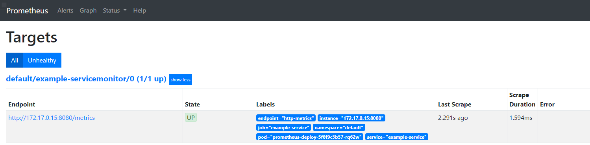
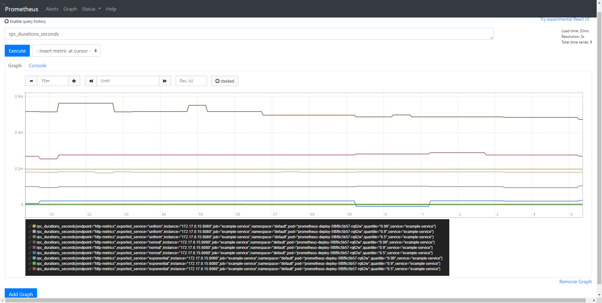
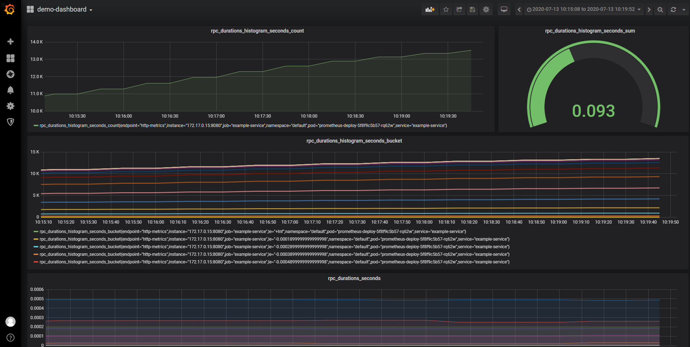

# ServiceMonitor Trait

oam-kubernetes-runtime supports existing third-party Kubernetes resources, this section introduce how to use k8s CR [ServiceMonitor](https://github.com/coreos/kube-prometheus#defining-the-servicemonitor-for-each-additional-namespace) in oam-kubernetes-runtime. 

## Pre-requisites

- Please follow [common prerequisites](../../README.md) to install Crossplane and OAM.

- Deploy Prometheus and Grafana using the Prometheus Operator ([kube-prometheus](https://github.com/coreos/kube-prometheus)).
```
git clone https://github.com/coreos/kube-prometheus.git

kubectl create -f manifests/setup

kubectl create -f manifests/
```
- Access the dashboards
```
kubectl port-forward --namespace monitoring svc/prometheus-k8s 9090

kubectl port-forward --namespace monitoring svc/grafana 3000
```

## Apply the demo

```
kubectl apply -f catalog/traits/servicemonitor
```

- Then a k8s native Service and a third-party CR ServiceMonitor are created.
```
kubectl get service
NAME              TYPE        CLUSTER-IP      EXTERNAL-IP   PORT(S)    AGE
example-service   ClusterIP   10.102.113.28   <none>        8080/TCP   66m

kubectl get servicemonitor
NAME                     AGE
example-servicemonitor   66m
```

## Access Prometheus

You can see a servicemonitor pointing to the metrics port of our application.

And you can also see the metrics exposed by the metrics port of application itself.




## Access Grafana

For Grafana, you don't have to configure Prometheus datasource because kube-prometheus has already been done and there are some default dashboard templates to use.

Or you can customize a new dashboard: The metrics such as "rpc_durations_seconds" exposed by Deployment have already been automatically collected by Prometheus, so we just have to select the metrics we want to create panels.



## How ServiceMonitor works?

ServiceMonitor automatically identify services with certain labels and retrieve data from those services. Note that the service should point to the metrics port exposed by the application itself.

In addition: For how to customize metrics ports, you can refer to the [kubebuilder metrics framework](https://book.kubebuilder.io/reference/metrics.html).