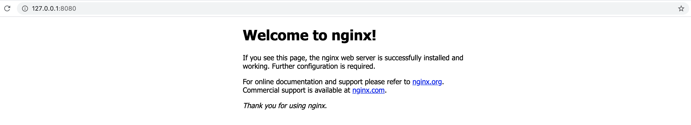
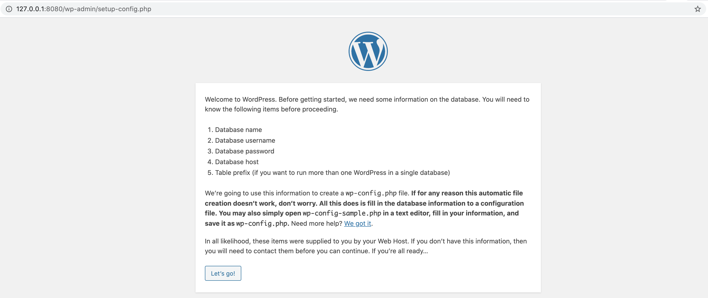

# AdvancedStatefulSet Workload

AdvancedStatefulSet is a workload type for Enhanced rolling update workflow of default StatefulSet controller.

For detailed reference, please refer to [AdvancedStatefulSet Reference](./advancedstatefulset-reference.md).

## Prepare WorkloadDefinition to extend `AdvancedStatefulSet` workload type

Follow the instruction [Extending Workload Types in KubeVela](https://kubevela.io/#/en/platform-engineers/workload-type?id=extending-workload-types-in-kubevela) to prepare [workloadDefinition.yaml](./workloadDefinition.yaml)
which is assembled by [pureWorkloadDefinition.yaml](./pureWorkloadDefinition.yaml) and [advancedstatefulset.cue](./advancedstatefulset.cue).

Apply it and check whether `advancedstatefulset` has become one of the workload types by `vela workload`.

```
$ kubectl apply -f workloadDefinition.yaml
workloaddefinition.core.oam.dev/advancedstatefulset created

$ vela workloads
TYPE       	CATEGORY	DESCRIPTION
Automatically discover capabilities successfully ✅ Add(0) Update(1) Delete(0)

TYPE                	CATEGORY	DESCRIPTION
*advancedstatefulset	workload	Enhanced rolling update workflow of default StatefulSet controller

NAME               	DESCRIPTION
advancedstatefulset	Enhanced rolling update workflow of default StatefulSet controller
deployment         	A Deployment provides declarative updates for Pods and ReplicaSets
task               	`Task` is a workload type to describe jobs that run code or a script to completion.
webservice         	`Webservice` is a workload type to describe long-running, scalable, containerized services that have a stable network endpoint to receive external network traffic from customers. If workload type is skipped for any service defined in Appfile, it will be defaulted to `Web Service` type.
worker             	`Worker` is a workload type to describe long-running, scalable, containerized services that running at backend. They do NOT have network endpoint to receive external network traffic.
```

## Deploy an application with the workload

Prepare Appfile [vela.yaml](./vela.yaml).

```yaml
name: hello
services:
  backend:
    type: advancedstatefulset
    image: nginx:1.9.4 # v1
    # image: wordpress:php7.4-apache # v2
    port: 80
    replicas: 10

    parallelPodManagementPolicy:
      maxUnavailable: 2
    podUpdatePolicy: "InPlaceIfPossible"
    inPlaceUpdateStrategy:
      gracePeriodSeconds: 10
```

The image is `nginx:1.9.4`. `parallelPodManagementPolicy.maxUnavailable` means there could be maximal of two Pods unavailable during rolling update.

Deploy the Appfile by `vela up`.

```
$ vela up
Parsing vela appfile ...
Loading templates ...

Rendering configs for service (backend)...
Writing deploy config to (.vela/deploy.yaml)

Applying deploy configs ...
Checking if app has been deployed...
App exists, updating existing deployment...
✅ App has been deployed 🚀🚀🚀
    Port forward: vela port-forward hello
             SSH: vela exec hello
         Logging: vela logs hello
      App status: vela status hello
  Service status: vela status hello --svc backend
```

The application has been deployed. The application has 10 replicas of Pod and its service could be accessed through `vela port-forward`.

```
$ kubectl get StatefulSet.apps.kruise.io --watch
NAME      DESIRED   CURRENT   UPDATED   READY   AGE
backend   10                                    0s
backend   10        10        10        0       0s
backend   10        10        10        1       4s
backend   10        10        10        2       5s
backend   10        10        10        3       7s
backend   10        10        10        4       8s
backend   10        10        10        5       10s
backend   10        10        10        6       11s
backend   10        10        10        7       14s
backend   10        10        10        8       17s
backend   10        10        10        9       20s
backend   10        10        10        9       23s
backend   10        10        10        10      23s
```



Update the image to `wordpress:php7.4-apache` and run `vela up` to monitor the process of rolling update.

```shell
➜  /Users/zhouzhengxi kubectl get pod -L controller-revision-hash -o wide --watch | grep backend
backend-0   1/1     Running   0          43s   172.20.1.17    cn-hongkong.10.0.1.241   <none>           <none>            backend-5bb9cd75cd
backend-1   1/1     Running   0          43s   172.20.1.19    cn-hongkong.10.0.1.241   <none>           <none>            backend-5bb9cd75cd
backend-2   1/1     Running   0          43s   172.20.0.239   cn-hongkong.10.0.1.240   <none>           <none>            backend-5bb9cd75cd
backend-3   1/1     Running   0          43s   172.20.1.20    cn-hongkong.10.0.1.241   <none>           <none>            backend-5bb9cd75cd
backend-4   1/1     Running   0          43s   172.20.1.15    cn-hongkong.10.0.1.241   <none>           <none>            backend-5bb9cd75cd
backend-5   1/1     Running   0          43s   172.20.1.21    cn-hongkong.10.0.1.241   <none>           <none>            backend-5bb9cd75cd
backend-6   1/1     Running   0          43s   172.20.1.18    cn-hongkong.10.0.1.241   <none>           <none>            backend-5bb9cd75cd
backend-7   1/1     Running   0          43s   172.20.0.240   cn-hongkong.10.0.1.240   <none>           <none>            backend-5bb9cd75cd
backend-8   1/1     Running   0          43s   172.20.1.16    cn-hongkong.10.0.1.241   <none>           <none>            backend-5bb9cd75cd
backend-9   1/1     Running   0          43s   172.20.0.241   cn-hongkong.10.0.1.240   <none>           <none>            backend-5bb9cd75cd

backend-9   1/1     Terminating   0          3m36s   172.20.0.241   cn-hongkong.10.0.1.240   <none>           <none>            backend-5bb9cd75cd
backend-8   1/1     Terminating   0          3m36s   172.20.1.16    cn-hongkong.10.0.1.241   <none>           <none>            backend-5bb9cd75cd
backend-8   0/1     Terminating   0          3m36s   172.20.1.16    cn-hongkong.10.0.1.241   <none>           <none>            backend-5bb9cd75cd
backend-9   0/1     Terminating   0          3m37s   172.20.0.241   cn-hongkong.10.0.1.240   <none>           <none>            backend-5bb9cd75cd
backend-8   0/1     Terminating   0          3m37s   172.20.1.16    cn-hongkong.10.0.1.241   <none>           <none>            backend-5bb9cd75cd
backend-8   0/1     Terminating   0          3m37s   172.20.1.16    cn-hongkong.10.0.1.241   <none>           <none>            backend-5bb9cd75cd
backend-8   0/1     Pending       0          0s      <none>         <none>                   <none>           <none>            backend-7dc7db569
backend-8   0/1     Pending       0          0s      <none>         cn-hongkong.10.0.1.240   <none>           <none>            backend-7dc7db569
backend-8   0/1     ContainerCreating   0          0s      <none>         cn-hongkong.10.0.1.240   <none>           <none>            backend-7dc7db569
backend-9   0/1     Terminating         0          3m46s   172.20.0.241   cn-hongkong.10.0.1.240   <none>           <none>            backend-5bb9cd75cd
backend-9   0/1     Terminating         0          3m46s   172.20.0.241   cn-hongkong.10.0.1.240   <none>           <none>            backend-5bb9cd75cd
backend-9   0/1     Pending             0          0s      <none>         <none>                   <none>           <none>            backend-7dc7db569
backend-9   0/1     Pending             0          0s      <none>         cn-hongkong.10.0.1.241   <none>           <none>            backend-7dc7db569
backend-9   0/1     ContainerCreating   0          0s      <none>         cn-hongkong.10.0.1.241   <none>           <none>            backend-7dc7db569
backend-8   1/1     Running             0          23s     172.20.0.242   cn-hongkong.10.0.1.240   <none>           <none>            backend-7dc7db569
backend-7   1/1     Terminating         0          4m      172.20.0.240   cn-hongkong.10.0.1.240   <none>           <none>            backend-5bb9cd75cd
backend-7   0/1     Terminating         0          4m1s    172.20.0.240   cn-hongkong.10.0.1.240   <none>           <none>            backend-5bb9cd75cd
backend-7   0/1     Terminating         0          4m2s    172.20.0.240   cn-hongkong.10.0.1.240   <none>           <none>            backend-5bb9cd75cd
backend-7   0/1     Terminating         0          4m2s    172.20.0.240   cn-hongkong.10.0.1.240   <none>           <none>            backend-5bb9cd75cd
backend-7   0/1     Pending             0          0s      <none>         <none>                   <none>           <none>            backend-7dc7db569
backend-7   0/1     Pending             0          0s      <none>         cn-hongkong.10.0.1.241   <none>           <none>            backend-7dc7db569
backend-7   0/1     ContainerCreating   0          0s      <none>         cn-hongkong.10.0.1.241   <none>           <none>            backend-7dc7db569
backend-9   1/1     Running             0          24s     172.20.1.22    cn-hongkong.10.0.1.241   <none>           <none>            backend-7dc7db569
backend-6   1/1     Terminating         0          4m11s   172.20.1.18    cn-hongkong.10.0.1.241   <none>           <none>            backend-5bb9cd75cd
backend-6   0/1     Terminating         0          4m12s   172.20.1.18    cn-hongkong.10.0.1.241   <none>           <none>            backend-5bb9cd75cd
backend-7   1/1     Running             0          11s     172.20.1.23    cn-hongkong.10.0.1.241   <none>           <none>            backend-7dc7db569
backend-5   1/1     Terminating         0          4m14s   172.20.1.21    cn-hongkong.10.0.1.241   <none>           <none>            backend-5bb9cd75cd
backend-5   0/1     Terminating         0          4m15s   172.20.1.21    cn-hongkong.10.0.1.241   <none>           <none>            backend-5bb9cd75cd
backend-5   0/1     Terminating         0          4m16s   172.20.1.21    cn-hongkong.10.0.1.241   <none>           <none>            backend-5bb9cd75cd
backend-5   0/1     Terminating         0          4m16s   172.20.1.21    cn-hongkong.10.0.1.241   <none>           <none>            backend-5bb9cd75cd
backend-5   0/1     Pending             0          0s      <none>         <none>                   <none>           <none>            backend-7dc7db569
backend-5   0/1     Pending             0          0s      <none>         cn-hongkong.10.0.1.240   <none>           <none>            backend-7dc7db569
backend-5   0/1     ContainerCreating   0          0s      <none>         cn-hongkong.10.0.1.240   <none>           <none>            backend-7dc7db569
backend-6   0/1     Terminating         0          4m17s   172.20.1.18    cn-hongkong.10.0.1.241   <none>           <none>            backend-5bb9cd75cd
backend-6   0/1     Terminating         0          4m17s   172.20.1.18    cn-hongkong.10.0.1.241   <none>           <none>            backend-5bb9cd75cd
backend-6   0/1     Pending             0          0s      <none>         <none>                   <none>           <none>            backend-7dc7db569
backend-6   0/1     Pending             0          0s      <none>         cn-hongkong.10.0.1.241   <none>           <none>            backend-7dc7db569
backend-6   0/1     ContainerCreating   0          0s      <none>         cn-hongkong.10.0.1.241   <none>           <none>            backend-7dc7db569
backend-5   1/1     Running             0          5s      172.20.0.243   cn-hongkong.10.0.1.240   <none>           <none>            backend-7dc7db569
backend-4   1/1     Terminating         0          4m21s   172.20.1.15    cn-hongkong.10.0.1.241   <none>           <none>            backend-5bb9cd75cd
backend-4   0/1     Terminating         0          4m22s   172.20.1.15    cn-hongkong.10.0.1.241   <none>           <none>            backend-5bb9cd75cd
backend-6   1/1     Running             0          5s      172.20.1.24    cn-hongkong.10.0.1.241   <none>           <none>            backend-7dc7db569
backend-3   1/1     Terminating         0          4m22s   172.20.1.20    cn-hongkong.10.0.1.241   <none>           <none>            backend-5bb9cd75cd
backend-3   0/1     Terminating         0          4m23s   172.20.1.20    cn-hongkong.10.0.1.241   <none>           <none>            backend-5bb9cd75cd
backend-3   0/1     Terminating         0          4m27s   172.20.1.20    cn-hongkong.10.0.1.241   <none>           <none>            backend-5bb9cd75cd
backend-3   0/1     Terminating         0          4m27s   172.20.1.20    cn-hongkong.10.0.1.241   <none>           <none>            backend-5bb9cd75cd
backend-3   0/1     Pending             0          0s      <none>         <none>                   <none>           <none>            backend-7dc7db569
backend-3   0/1     Pending             0          0s      <none>         cn-hongkong.10.0.1.240   <none>           <none>            backend-7dc7db569
backend-3   0/1     ContainerCreating   0          0s      <none>         cn-hongkong.10.0.1.240   <none>           <none>            backend-7dc7db569
backend-4   0/1     Terminating         0          4m27s   172.20.1.15    cn-hongkong.10.0.1.241   <none>           <none>            backend-5bb9cd75cd
backend-4   0/1     Terminating         0          4m27s   172.20.1.15    cn-hongkong.10.0.1.241   <none>           <none>            backend-5bb9cd75cd
backend-4   0/1     Pending             0          0s      <none>         <none>                   <none>           <none>            backend-7dc7db569
backend-4   0/1     Pending             0          0s      <none>         cn-hongkong.10.0.1.240   <none>           <none>            backend-7dc7db569
backend-4   0/1     ContainerCreating   0          0s      <none>         cn-hongkong.10.0.1.240   <none>           <none>            backend-7dc7db569
backend-4   1/1     Running             0          6s      172.20.0.244   cn-hongkong.10.0.1.240   <none>           <none>            backend-7dc7db569
backend-2   1/1     Terminating         0          4m33s   172.20.0.239   cn-hongkong.10.0.1.240   <none>           <none>            backend-5bb9cd75cd
backend-2   0/1     Terminating         0          4m34s   172.20.0.239   cn-hongkong.10.0.1.240   <none>           <none>            backend-5bb9cd75cd
backend-3   1/1     Running             0          9s      172.20.0.245   cn-hongkong.10.0.1.240   <none>           <none>            backend-7dc7db569
backend-1   1/1     Terminating         0          4m36s   172.20.1.19    cn-hongkong.10.0.1.241   <none>           <none>            backend-5bb9cd75cd
backend-1   0/1     Terminating         0          4m37s   172.20.1.19    cn-hongkong.10.0.1.241   <none>           <none>            backend-5bb9cd75cd
backend-2   0/1     Terminating         0          4m46s   172.20.0.239   cn-hongkong.10.0.1.240   <none>           <none>            backend-5bb9cd75cd
backend-2   0/1     Terminating         0          4m46s   172.20.0.239   cn-hongkong.10.0.1.240   <none>           <none>            backend-5bb9cd75cd
backend-2   0/1     Pending             0          0s      <none>         <none>                   <none>           <none>            backend-7dc7db569
backend-2   0/1     Pending             0          0s      <none>         cn-hongkong.10.0.1.240   <none>           <none>            backend-7dc7db569
backend-2   0/1     ContainerCreating   0          0s      <none>         cn-hongkong.10.0.1.240   <none>           <none>            backend-7dc7db569
backend-1   0/1     Terminating         0          4m47s   172.20.1.19    cn-hongkong.10.0.1.241   <none>           <none>            backend-5bb9cd75cd
backend-1   0/1     Terminating         0          4m47s   172.20.1.19    cn-hongkong.10.0.1.241   <none>           <none>            backend-5bb9cd75cd
backend-1   0/1     Pending             0          0s      <none>         <none>                   <none>           <none>            backend-7dc7db569
backend-1   0/1     Pending             0          0s      <none>         cn-hongkong.10.0.1.241   <none>           <none>            backend-7dc7db569
backend-1   0/1     ContainerCreating   0          0s      <none>         cn-hongkong.10.0.1.241   <none>           <none>            backend-7dc7db569
backend-2   1/1     Running             0          6s      172.20.0.246   cn-hongkong.10.0.1.240   <none>           <none>            backend-7dc7db569
backend-0   1/1     Terminating         0          4m52s   172.20.1.17    cn-hongkong.10.0.1.241   <none>           <none>            backend-5bb9cd75cd
backend-1   1/1     Running             0          5s      172.20.1.25    cn-hongkong.10.0.1.241   <none>           <none>            backend-7dc7db569
backend-0   0/1     Terminating         0          4m53s   172.20.1.17    cn-hongkong.10.0.1.241   <none>           <none>            backend-5bb9cd75cd
backend-0   0/1     Terminating         0          4m54s   172.20.1.17    cn-hongkong.10.0.1.241   <none>           <none>            backend-5bb9cd75cd
backend-0   0/1     Terminating         0          4m54s   172.20.1.17    cn-hongkong.10.0.1.241   <none>           <none>            backend-5bb9cd75cd
backend-0   0/1     Pending             0          0s      <none>         <none>                   <none>           <none>            backend-7dc7db569
backend-0   0/1     Pending             0          0s      <none>         cn-hongkong.10.0.1.240   <none>           <none>            backend-7dc7db569
backend-0   0/1     ContainerCreating   0          0s      <none>         cn-hongkong.10.0.1.240   <none>           <none>            backend-7dc7db569
backend-0   1/1     Running             0          5s      172.20.0.247   cn-hongkong.10.0.1.240   <none>           <none>            backend-7dc7db569
```

We notice there are only one or two Pods terminating and creating at the same time, which means there are a maximal of two Pods
unavailable.

And visit the home page of the application, and we can see the installation index of Wordpress.

```shell
$ vela port-forward hello
Forwarding from 127.0.0.1:8000 -> 8000
Forwarding from [::1]:8000 -> 8000

Forward successfully! Opening browser ...
Handling connection for 8000
Handling connection for 8000
```

