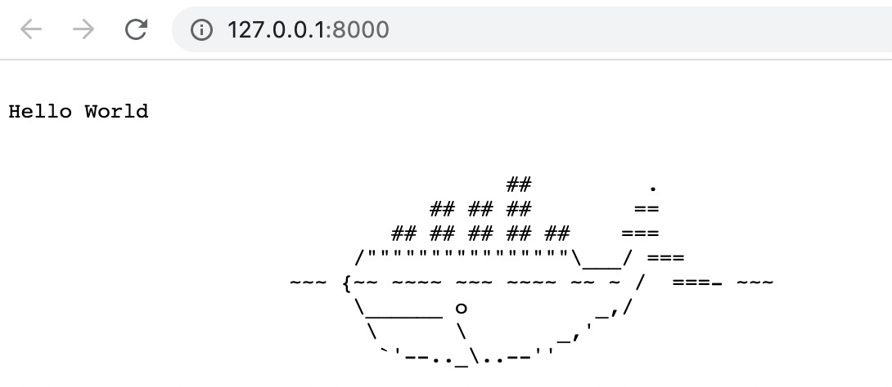

# Deployment Workload

## Prepare WorkloadDefinition to extend `deployment` workload type

Follow the instruction [Extending Workload Types in KubeVela](https://kubevela.io/#/en/platform-engineers/workload-type?id=extending-workload-types-in-kubevela) to prepare [workloadDefinition.yaml](./workloadDefinition.yaml)
which is assembled by [pureWorkloadDefinition.yaml](./pureWorkloadDefinition.yaml) and [deployment.cue](./deployment.cue).

Apply it and check whether `deployment` has become one of the workload types by `vela workload`.

```
$ kubectl apply -f workloadDefinition.yaml
workloaddefinition.core.oam.dev/deployment created

$ vela workloads
TYPE       	CATEGORY	DESCRIPTION
+deployment	workload	A Deployment provides declarative updates for Pods and ReplicaSets

NAME               	DESCRIPTION
deployment         	A Deployment provides declarative updates for Pods and ReplicaSets
task               	`Task` is a workload type to describe jobs that run code or a script to completion.
webservice         	`Webservice` is a workload type to describe long-running, scalable, containerized services that have a stable network endpoint to receive external network traffic from customers. If workload type is skipped for any service defined in Appfile, it will be defaulted to `Web Service` type.
worker             	`Worker` is a workload type to describe long-running, scalable, containerized services that running at backend. They do NOT have network endpoint to receive external network traffic.
```

## Deploy an application with the workload

Prepare Appfile [vela.yaml](./vela.yaml) and deploy it by `vela up`.

```
$ vela up
Parsing vela appfile ...
Loading templates ...

Rendering configs for service (backend)...
Writing deploy config to (.vela/deploy.yaml)

Applying deploy configs ...
Checking if app has been deployed...
App has not been deployed, creating a new deployment...
✅ App has been deployed 🚀🚀🚀
    Port forward: vela port-forward hello
             SSH: vela exec hello
         Logging: vela logs hello
      App status: vela status hello
  Service status: vela status hello --svc backend
```

The application has been deployed and its service could be accessed through `vela port-forward`.

```
$ vela show hello
About:

  Name:      	hello
  Created at:	2020-12-25 19:20:32.982585 +0800 CST
  Updated at:	2020-12-25 19:20:32.982585 +0800 CST


Environment:

  Namespace:	default

Services:

  - Name:        	backend
    WorkloadType:	deployment
    Arguments:
      cpu:          	0.5
      image:        	crccheck/hello-world
      port:         	8000
      Traits:

$ vela port-forward hello
Forwarding from 127.0.0.1:8000 -> 8000
Forwarding from [::1]:8000 -> 8000

Forward successfully! Opening browser ...
Handling connection for 8000
Handling connection for 8000
```

